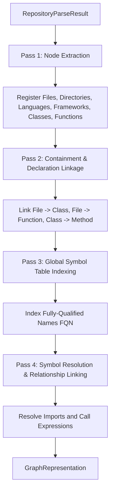

# Phase 3 Graph Builder Architecture Design

This document details the architectural design for the **Phase 3 Graph Builder** in Git2OKF. The purpose of this module is to ingest normalized AST parsing outputs (`RepositoryParseResult`) and produce a structured relationship graph (`GraphRepresentation`).

---

## 1. Graph Module Structure

The `src/graph/` directory is organized as follows:

```
src/graph/
├── mod.rs          - Module entrypoint and public interface re-exports.
├── types.rs        - Basic identifiers, enums (NodeType, EdgeType), and type aliases.
├── node.rs         - Graph Node structure and node-specific builder helpers.
├── edge.rs         - Graph Edge structure and relationship attributes.
├── storage.rs      - In-memory graph representation and index backing storage.
├── resolver.rs     - Symbol lookup, namespace resolution, and import mapping.
├── builder.rs      - Orchestrator that consumes RepositoryParseResult and outputs GraphRepresentation.
└── serializer.rs   - Logic to serialize/export the graph into JSON, YAML, or OKF formats.
```

### Module Responsibilities

* **`mod.rs`**: Exposes a clean, high-level API to other parts of the application (such as the CLI handler). It hides low-level graph traversal details.
* **`types.rs`**: Declares shared primitives, including the custom `NodeId` wrapper and enums distinguishing nodes and edges.
* **`node.rs`**: Focuses entirely on the `Node` struct and helper methods to instantiate nodes from individual files, functions, or classes.
* **`edge.rs`**: Defines the `Edge` struct linking two nodes.
* **`storage.rs`**: Encapsulates the actual graph data structure (such as adjacency maps or third-party graph containers) and provides safe APIs to insert nodes/edges and fetch neighbors.
* **`resolver.rs`**: Implements the symbol table and resolving algorithms (linking a method call identifier in file A to a class definition in file B).
* **`builder.rs`**: Implements the `GraphBuilder` orchestrator. It executes the multi-stage pipeline that processes the parsed repository into the final graph.
* **`serializer.rs`**: Serializes the in-memory graph representation into standard outputs.

---

## 2. Separate Identity Layers

To isolate graph implementation details from consumer logic, the graph uses three separate layers of identity:

1. **`CanonicalIdentifier` (String)**:
   * **Role**: The human-readable, stable, and deterministic unique path identifying the symbol globally (e.g., `git2okf://my-repo/src/core/errors.rs#ast::ClassNode`).
   * **Scope**: Public API, serialization, cross-file resolution keys, and external reference targets.
2. **`NodeId` (u64 Wrapper)**:
   * **Role**: A lightweight, numeric identifier unique to the graph instance.
   * **Scope**: Public Graph API for node-to-node queries, edge declarations, and traversal indices.
3. **`NodeIndex` (Petgraph Internal Index)**:
   * **Role**: The memory index structure native to the `petgraph` library.
   * **Scope**: **Strictly private** to `storage.rs`. The public graph API never exposes `NodeIndex` to external modules to shield consumers from internal library dependencies.

### Identity Flow
* Consumers query nodes using `CanonicalIdentifier` or `NodeId`.
* `storage.rs` maps `NodeId` to the private `NodeIndex` internally during graph storage operations.

---

## 3. Node Design

Nodes represent structural elements in the repository. We define them with a strict, serializable layout.

### NodeType Enum

```rust
#[derive(Debug, Clone, Copy, PartialEq, Eq, Hash, Serialize, Deserialize)]
pub enum NodeType {
    Repository,
    Workspace,
    Package,
    Crate,
    Directory,
    File,
    Namespace,
    Interface,
    Trait,
    Struct,
    Class,
    Enum,
    Function,
    Method,
    Macro,
    TypeAlias,
    Constant,
    Import,
    Dependency,
    Language,
    Framework,
    Unknown,
}
```

### First-Class Nodes vs. Metadata

* **First-Class Nodes**:
  * `Macro`, `TypeAlias`, `Constant` are designated as **first-class node types** to allow direct tracking of usage linkages, external imports, and macro expansions.
  * Structural scopes (`Repository`, `Workspace`, `Package`, `Directory`, `File`, `Namespace`, `Interface`, `Trait`, `Struct`, `Enum`, `Class`, `Method`, `Function`) remain first-class nodes.
* **Metadata-Only representation**:
  * Local variables remain encapsulated within their enclosing scopes' metadata maps rather than forming graph nodes.

### Node Struct

```rust
use serde_json::{Map, Value};

#[derive(Debug, Clone, Copy, PartialEq, Eq, PartialOrd, Ord, Hash, Serialize, Deserialize)]
pub struct NodeId(pub u64);

#[derive(Debug, Clone, Serialize, Deserialize)]
pub struct Node {
    /// Numeric ID for graph API operations
    pub id: NodeId,
    /// Stable deterministic URI for serialization and stable references
    pub canonical_identifier: String,
    /// The name of the symbol or file (e.g., "UserController", "process_data")
    pub name: String,
    /// The classification of the node
    pub node_type: NodeType,
    /// Path to the source file where the node was declared (if applicable)
    pub source_file: Option<String>,
    /// Typed metadata map supporting nested structures (arrays, integers, booleans)
    pub metadata: Map<String, Value>,
}
```

---

## 4. Edge Design

Edges represent directed relationships between nodes.

### EdgeType Enum

```rust
#[derive(Debug, Clone, Copy, PartialEq, Eq, Hash, Serialize, Deserialize)]
pub enum EdgeType {
    Calls,         // Function/Method calls another Function/Method
    Imports,       // File imports a Module/File/Symbol
    Declares,      // File declares a Class or Function; Class declares a Method
    Uses,          // Class/Function utilizes a Dependency/Package
    Extends,       // Class inherits from another Class
    Implements,    // Class implements an Interface/Trait
    DependsOn,     // Package depends on another Package
    BelongsTo,     // Node belongs to a Namespace/Module
    Contains,      // Directory/File containment relationships
    References,    // Symbol reference that isn't a direct call
    Overrides,     // Method overrides parent method
    Exports,       // Module exports symbol
    InstanceOf,    // Variable is an instance of a Class
    AnnotatedWith, // Symbol is decorated/annotated with metadata
}
```

### Edge Struct

```rust
use serde_json::{Map, Value};

#[derive(Debug, Clone, Serialize, Deserialize)]
pub struct Edge {
    /// The source NodeId
    pub source: NodeId,
    /// The target NodeId
    pub target: NodeId,
    /// The relationship type
    pub edge_type: EdgeType,
    /// Metadata supporting visibility flags, line ranges, and custom annotations
    pub metadata: Map<String, Value>,
}
```

---

## 5. GraphRepresentation Definition

We define `GraphRepresentation` as the master struct that aggregates the graph storage engine, indices, lookup mappings, and statistics.

```rust
use std::collections::HashMap;

#[derive(Debug, Serialize, Deserialize, Clone)]
pub struct GraphRepresentation {
    /// In-memory graph storage backed by petgraph
    pub storage: GraphStorage,
    /// Bidirectional lookup map for node canonical identifiers to NodeIds
    pub canonical_index: HashMap<String, NodeId>,
    /// Global Symbol Table mapping symbol names to target NodeIds
    pub symbol_table: SymbolTable,
    /// Structural repository metadata (excludes git-history details)
    pub repository_metadata: RepositoryMetadata,
    /// Computed metrics for static analysis summary
    pub statistics: GraphStatistics,
}

#[derive(Debug, Serialize, Deserialize, Clone)]
pub struct RepositoryMetadata {
    /// Name of the repository
    pub name: String,
    /// Main classification language
    pub primary_language: String,
    /// List of root directories included in the graph
    pub source_directories: Vec<String>,
}

#[derive(Debug, Serialize, Deserialize, Clone)]
pub struct GraphStatistics {
    pub total_nodes: usize,
    pub total_edges: usize,
    pub max_depth: usize,
    pub isolated_nodes: usize,
}
```

---

## 6. Unresolved Symbol Resolution Strategy

In multi-file codebases, references to external libraries or unparsed modules often result in unresolved symbols. We design a stable strategy to support these references.

### Evaluation of Options

1. **Resolution Status Enums**:
   * *Tradeoff*: Simple to flag, but fails to define a target node for relational edge mapping.
2. **Dedicated Unresolved Node Types**:
   * *Tradeoff*: Explicit classification, but bloats node types and creates design redundancies.
3. **Placeholder Nodes with Metadata Flag (Recommended)**:
   * *Tradeoff*: Create placeholder nodes when a symbol cannot be resolved locally. The placeholder node is marked with `NodeType::Unknown` or `external: true` inside metadata, and assigned an external URI: `external://[package]/[symbol]`.
   * *Justification*: This approach preserves graph connectivity and allows edges (`Calls`, `Extends`) to map cleanly to external endpoints.

---

## 7. Repository Hierarchy

We enforce a strict containment hierarchy:

$$\text{Repository} \longrightarrow \text{Workspace} \longrightarrow \text{Package} \longrightarrow \text{Directory} \longrightarrow \text{File} \longrightarrow \text{Symbol}$$

This containment hierarchy improves other systems:
* **OKF Generation**: Maps directories and files directly to hierarchical YAML files.
* **Architecture Visualization**: Enables collapsible view models (zooming out to Package level, zooming in to Class level).
* **Dependency Analysis**: Helps flag circular dependencies across package and folder boundaries.
* **Semantic Search**: Constrains queries to specific sub-modules, namespaces, or workspaces.

---

## 8. Deterministic Node Identity Strategy

Stable external identifiers are built using a URI schema format:

$$\text{git2okf://[repo-name]/[package-name]/[relative-file-path]\#[fully-qualified-name]}$$

* **File Node Example**: `git2okf://my-repo/src/core/errors.rs`
* **Class Node Example**: `git2okf://my-repo/src/parser/ast.rs#ast::ClassNode`
* **Method Node Example**: `git2okf://my-repo/src/parser/ast.rs#ast::ClassNode::new`

### Design Compliance
* **Stable**: Does not change between executions.
* **Deterministic**: Same file path and naming yields identical IDs.
* **Collision Resistant**: URI formatting ensures identical class names in different directories remain isolated.
* **Serialization Friendly**: Simple string formats that write directly to YAML and JSON targets.

---

## 9. Graph Builder Pipeline

Converting `RepositoryParseResult` to `GraphRepresentation` is implemented as a multi-pass pipeline.



### Pipeline Details

1. **Node Extraction (Pass 1)**: Traverse all files in the `RepositoryParseResult`. Extract metadata and create nodes for every file, class, trait, function, macro, type alias, constant, and external dependency.
2. **Containment Linkage (Pass 2)**: Create structural hierarchy edges. Link files to their declared classes and functions, and classes to their declared methods (`Declares` / `Contains` edges).
3. **Symbol Table Generation (Pass 3)**: Traverse the extracted declaration nodes and index their names globally (e.g., mapping class `UserController` to its file node and fully-qualified namespace path).
4. **Resolution & Relationship Linking (Pass 4)**: Iterate through all unresolved references (imports, require calls, and method invocations). Query the symbol table to resolve the targets. Create directed edges (e.g., `Calls`, `Imports`, `Uses`) between the caller node and target node.

---

## 10. Symbol Resolution Strategy

Symbol resolution links identifiers (like `User::find()` or `import { component }`) to their actual definitions across different files.

### Cross-File Namespace Index
We maintain a global index inside `resolver.rs`:
```rust
pub struct SymbolDefinition {
    pub node_id: NodeId,
    pub namespace: Option<String>,
    pub file_path: String,
}

pub struct SymbolTable {
    /// Maps simple names (e.g., "UserController") to potential definitions
    pub declarations: HashMap<String, Vec<SymbolDefinition>>,
}
```

### Resolution Logic

* **Namespace Resolution**: Track current module paths or namespaces (e.g., Python package names based on directory structures, PHP namespace declarations). Fully-qualify class/struct symbols.
* **Import Resolution**: For a given file, parse its import nodes to create a local mapping:
  `Alias/Short Name -> Fully Qualified Name / Target Path`.
  When a symbol (like `React` or `os`) is used in a call, inspect the file's import map to find its source node.
* **Class & Member Resolution**:
  * Local calls: Check if the calling function belongs to a class. If yes, check if the method exists in the same class.
  * Inheritance calls: Follow `Extends` and `Implements` edges in the graph to check parent class methods.
  * Global calls: If not found locally, query the global `SymbolTable`.

---

## 11. Graph Storage Strategy

To represent the graph structure in memory, we evaluate four options:

1. **Adjacency List (`Vec<Vec<Edge>>`)**:
   * *Pros*: Simple to implement, efficient memory footprints.
   * *Cons*: Checking if an edge exists between node A and B is $O(V)$ in the worst case.
2. **Adjacency Map (`HashMap<NodeId, HashMap<NodeId, Edge>>`)**:
   * *Pros*: Fast $O(1)$ lookups for node/edge existence checks. Easy graph modification.
   * *Cons*: High memory overhead due to multiple nested hash maps.
3. **Petgraph Integration (`petgraph::stable_graph::StableDiGraph`)**:
   * *Pros*: Highly optimized memory layout, built-in graph algorithms (DFS, BFS, cycle detection, strongly connected components), mature community ecosystem.
   * *Cons*: Direct manipulation requires index handling (`NodeIndex`, `EdgeIndex`) which can be verbose.
4. **Custom Storage**:
   * *Pros*: Custom fit for OKF layout requirements.
   * *Cons*: High development overhead, potential for bugs or suboptimal performance.

### Recommendation: Hybrid Adjacency Map + Petgraph

We will wrap `petgraph::stable_graph::StableDiGraph<Node, Edge>` inside `storage.rs`. 
We will augment it with helper lookup maps:
```rust
use petgraph::stable_graph::{NodeIndex, StableDiGraph};

pub struct GraphStorage {
    /// The primary petgraph structure
    graph: StableDiGraph<Node, Edge>,
    /// Fast index mapping deterministic Node IDs to petgraph NodeIndices
    node_map: HashMap<NodeId, NodeIndex>,
}
```
*Justification*: Petgraph provides raw storage and graph algorithms, while the wrapper index `node_map` provides $O(1)$ lookups. This avoids raw index tracking during graph construction.

---

## 12. Serialization Strategy

The `serializer.rs` module will serialize `GraphRepresentation` for different consumers:

* **JSON Output**: Exports a flat array of nodes and edges, compatible with graph visualizers (D3.js, Cytoscape):
  ```json
  {
    "nodes": [ { "id": 1, "canonical_identifier": "file_1", "type": "File", "name": "main.rs" } ],
    "edges": [ { "source": 1, "target": 2, "type": "Declares" } ]
  }
  ```
* **YAML Output**: Human-readable hierarchical configuration format.
* **OKF (Open Knowledge Format) Layout**: Organizes the graph structure into a directory of YAML files, nesting functions and classes under their parent file nodes to make it highly digestible for LLMs.

---

## 13. Performance Considerations

For larger projects (e.g., 10,000 files, 100,000 functions, and millions of relationships), building the graph can become a memory and CPU bottleneck.

* **Concurrency**: We will utilize the `rayon` crate to parallelize Pass 1 (Node Extraction) and Pass 3 (Symbol Table indexing) across all available CPU threads.
* **Lock-free Symbol Indexing**: We will utilize a concurrent hash map (like the `dashmap` crate) during index generation to avoid thread contention.
* **ID Interning**: Instead of storing duplicate long strings (file paths, namespaces) across nodes and edges, we can internalize names into integer keys or use shared reference-counted strings (`Rc<str>` or `Arc<str>`).
* **Chunked Traversal**: Perform resolution on a per-file basis rather than loading everything into a single synchronized step.

---

## 14. Phase 3 Implementation Roadmap

Once the freeze is lifted, the phase will proceed as follows:

```
Phase 3.1: Define Data Types (types.rs, node.rs, edge.rs)
   └── Phase 3.2: Implement Graph Storage & Indexes (storage.rs)
         └── Phase 3.3: Implement Symbol Table & Resolution (resolver.rs)
               └── Phase 3.4: Integrate Pipeline Orchestrator (builder.rs)
                     └── Phase 3.5: Implement Serialization & Exporters (serializer.rs)
```
