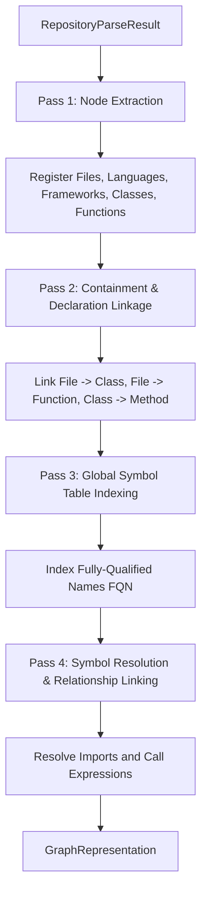

# Phase 3 Graph Builder Architecture Design

This document details the architectural design for the **Phase 3 Graph Builder** in Git2OKF. The purpose of this module is to ingest normalized AST parsing outputs (`RepositoryParseResult`) and produce a structured relationship graph (`GraphRepresentation`).

---

## 1. Graph Module Structure

The `src/graph/` directory will be organized as follows:

```
src/graph/
├── mod.rs          - Module entrypoint and public interface re-exports.
├── types.rs        - Basic identifiers, enums (NodeType, EdgeType), and type aliases.
├── node.rs         - Graph Node structure and node-specific builder helpers.
├── edge.rs         - Graph Edge structure and relationship attributes.
├── storage.rs      - In-memory graph representation and index backing storage.
├── resolver.rs     - Symbol lookup, namespace resolution, and import mapping.
├── builder.rs      - Orchestrator that consumes RepositoryParseResult and outputs GraphRepresentation.
└── serializer.rs   - Logic to serialize/export the graph into JSON, YAML, or OKF formats.
```

### Module Responsibilities

* **`mod.rs`**: Exposes a clean, high-level API to other parts of the application (such as the CLI handler). It hides low-level graph traversal details.
* **`types.rs`**: Declares shared primitives, including the custom `NodeId` wrapper and enums distinguishing nodes and edges.
* **`node.rs`**: Focuses entirely on the `Node` struct and helper methods to instantiate nodes from individual files, functions, or classes.
* **`edge.rs`**: Defines the `Edge` struct linking two nodes.
* **`storage.rs`**: Encapsulates the actual graph data structure (such as adjacency maps or third-party graph containers) and provides safe APIs to insert nodes/edges and fetch neighbors.
* **`resolver.rs`**: Implements the symbol table and resolving algorithms (linking a method call identifier in file A to a class definition in file B).
* **`builder.rs`**: Implements the `GraphBuilder` orchestrator. It executes the multi-stage pipeline that processes the parsed repository into the final graph.
* **`serializer.rs`**: Serializes the in-memory graph representation into standard outputs.

---

## 2. Node Design

Nodes represent structural elements in the repository. We define them with a strict, serializable layout.

### NodeType Enum

```rust
#[derive(Debug, Clone, Copy, PartialEq, Eq, Hash, Serialize, Deserialize)]
pub enum NodeType {
    File,
    Function,
    Class,
    Method,
    Module,
    Import,
    Dependency,
    Route,
    Package,
    Framework,
    Language,
}
```

### Node Struct

```rust
use std::collections::HashMap;

#[derive(Debug, Clone, Serialize, Deserialize)]
pub struct Node {
    /// A unique identifier constructed deterministically (e.g., FQN or file path)
    pub id: String,
    /// The name of the symbol or file (e.g., "UserController", "process_data")
    pub name: String,
    /// The classification of the node
    pub node_type: NodeType,
    /// Path to the source file where the node was declared (if applicable)
    pub source_file: Option<String>,
    /// Open metadata map containing language-specific properties (line ranges, visibility, etc.)
    pub metadata: HashMap<String, String>,
}
```

---

## 3. Edge Design

Edges represent directed relationships between nodes.

### EdgeType Enum

```rust
#[derive(Debug, Clone, Copy, PartialEq, Eq, Hash, Serialize, Deserialize)]
pub enum EdgeType {
    Calls,      // Function/Method calls another Function/Method
    Imports,    // File imports a Module/File/Symbol
    Declares,   // File declares a Class or Function; Class declares a Method
    Uses,       // Class/Function utilizes a Dependency/Package
    Extends,    // Class inherits from another Class
    Implements, // Class implements an Interface/Trait
    DependsOn,  // Package depends on another Package
    BelongsTo,  // Node belongs to a Namespace/Module
    Contains,   // Directory/File containment relationships
    References, // Symbol reference that isn't a direct call
}
```

### Edge Struct

```rust
use std::collections::HashMap;

#[derive(Debug, Clone, Serialize, Deserialize)]
pub struct Edge {
    /// The source NodeId
    pub source: String,
    /// The target NodeId
    pub target: String,
    /// The relationship type
    pub edge_type: EdgeType,
    /// Optional attributes (e.g., line numbers of the call, call frequency)
    pub metadata: HashMap<String, String>,
}
```

---

## 4. Graph Builder Pipeline

Converting `RepositoryParseResult` to `GraphRepresentation` is implemented as a multi-pass pipeline to handle cross-file dependencies and forward references.



### Pipeline Details

1. **Node Extraction (Pass 1)**: Traverse all files in the `RepositoryParseResult`. Extract metadata and create nodes for every file, class, trait, function, and external dependency. Assign each node a unique, deterministic ID.
2. **Containment Linkage (Pass 2)**: Create structural hierarchy edges. Link files to their declared classes and functions, and classes to their declared methods (`Declares` / `Contains` edges).
3. **Symbol Table Generation (Pass 3)**: Traverse the extracted declaration nodes and index their names globally (e.g., mapping class `UserController` to its file node and fully-qualified namespace path).
4. **Resolution & Relationship Linking (Pass 4)**: Iterate through all unresolved references (imports, require calls, and method invocations). Query the symbol table to resolve the targets. Create directed edges (e.g., `Calls`, `Imports`, `Uses`) between the caller node and target node.

---

## 5. Symbol Resolution Strategy

Symbol resolution links identifiers (like `User::find()` or `import { component }`) to their actual definitions across different files.

### Cross-File Namespace Index
We maintain a global index inside `resolver.rs`:
```rust
pub struct SymbolDefinition {
    pub node_id: String,
    pub namespace: Option<String>,
    pub file_path: String,
}

pub struct SymbolTable {
    /// Maps simple names (e.g., "UserController") to potential definitions
    pub declarations: HashMap<String, Vec<SymbolDefinition>>,
}
```

### Resolution Logic

* **Namespace Resolution**: Track current module paths or namespaces (e.g., Python package names based on directory structures, PHP namespace declarations). Fully-qualify class/struct symbols.
* **Import Resolution**: For a given file, parse its import nodes to create a local mapping:
  `Alias/Short Name -> Fully Qualified Name / Target Path`.
  When a symbol (like `React` or `os`) is used in a call, inspect the file's import map to find its source node.
* **Class & Member Resolution**:
  * Local calls: Check if the calling function belongs to a class. If yes, check if the method exists in the same class.
  * Inheritance calls: Follow `Extends` and `Implements` edges in the graph to check parent class methods.
  * Global calls: If not found locally, query the global `SymbolTable`.

---

## 6. Graph Storage Strategy

To represent the graph structure in memory, we evaluate four options:

1. **Adjacency List (`Vec<Vec<Edge>>`)**:
   * *Pros*: Simple to implement, efficient memory footprints.
   * *Cons*: Checking if an edge exists between node A and B is $O(V)$ in the worst case.
2. **Adjacency Map (`HashMap<NodeId, HashMap<NodeId, Edge>>`)**:
   * *Pros*: Fast $O(1)$ lookups for node/edge existence checks. Easy graph modification.
   * *Cons*: High memory overhead due to multiple nested hash maps.
3. **Petgraph Integration (`petgraph::stable_graph::StableDiGraph`)**:
   * *Pros*: Highly optimized memory layout, built-in graph algorithms (DFS, BFS, cycle detection, strongly connected components), mature community ecosystem.
   * *Cons*: Direct manipulation requires index handling (`NodeIndex`, `EdgeIndex`) which can be verbose.
4. **Custom Storage**:
   * *Pros*: Custom fit for OKF layout requirements.
   * *Cons*: High development overhead, potential for bugs or suboptimal performance.

### Recommendation: Hybrid Adjacency Map + Petgraph

We will wrap `petgraph::stable_graph::StableDiGraph<Node, Edge>` inside `storage.rs`. 
We will augment it with helper lookup maps:
```rust
use petgraph::stable_graph::{NodeIndex, StableDiGraph};

pub struct GraphStorage {
    /// The primary petgraph structure
    pub graph: StableDiGraph<Node, Edge>,
    /// Fast index mapping deterministic Node IDs to petgraph NodeIndices
    pub node_map: HashMap<String, NodeIndex>,
}
```
*Justification*: Petgraph provides raw storage and graph algorithms, while the wrapper index `node_map` provides $O(1)$ lookups. This avoids raw index tracking during graph construction.

---

## 7. Serialization Strategy

The `serializer.rs` module will serialize `GraphRepresentation` for different consumers:

* **JSON Output**: Exports a flat array of nodes and edges, compatible with graph visualizers (D3.js, Cytoscape):
  ```json
  {
    "nodes": [ { "id": "file_1", "type": "File", "name": "main.rs" } ],
    "edges": [ { "source": "file_1", "target": "fn_1", "type": "Declares" } ]
  }
  ```
* **YAML Output**: Human-readable hierarchical configuration format.
* **OKF (Open Knowledge Format) Layout**: Organizes the graph structure into a directory of YAML files, nesting functions and classes under their parent file nodes to make it highly digestible for LLMs.

---

## 8. Performance Considerations

For larger projects (e.g., 10,000 files, 100,000 functions, and millions of relationships), building the graph can become a memory and CPU bottleneck.

* **Concurrency**: We will utilize the `rayon` crate to parallelize Pass 1 (Node Extraction) and Pass 3 (Symbol Table indexing) across all available CPU threads.
* **Lock-free Symbol Indexing**: We will utilize a concurrent hash map (like the `dashmap` crate) during index generation to avoid thread contention.
* **ID Interning**: Instead of storing duplicate long strings (file paths, namespaces) across nodes and edges, we can internalize names into integer keys or use shared reference-counted strings (`Rc<str>` or `Arc<str>`).
* **Chunked Traversal**: Perform resolution on a per-file basis rather than loading everything into a single synchronized step.

---

## 9. Phase 3 Implementation Roadmap

Once the freeze is lifted, the phase will proceed as follows:

```
Phase 3.1: Define Data Types (types.rs, node.rs, edge.rs)
   └── Phase 3.2: Implement Graph Storage & Indexes (storage.rs)
         └── Phase 3.3: Implement Symbol Table & Resolution (resolver.rs)
               └── Phase 3.4: Integrate Pipeline Orchestrator (builder.rs)
                     └── Phase 3.5: Implement Serialization & Exporters (serializer.rs)
```
